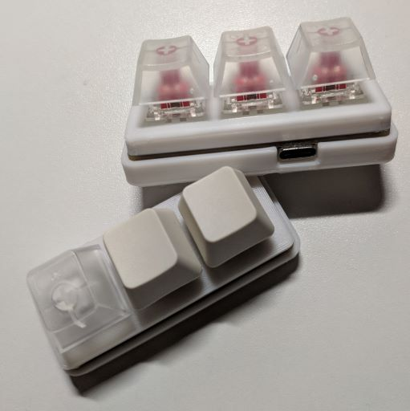

# Keyboard nano

基于CH549的多功能小键盘

## 功能

硬件

- 热拔插键轴
- WS2812 RGB
- CH549主控 8051
- Type-C 接口
- 3D 打印外壳

软件

- [x] 标准键盘输入，多键无冲突
- [x] 多媒体键输入
- [x] 模拟鼠标
- [x] 模拟触摸滑动、点击
- [x] 模拟 Surface Dial 轮盘
- [x] [上位机控制](https://github.com/Jackadminx/Keyboard_nano_client)
- [x] WS2812 RGB 功能
- [x] 片内 EEPROM 数据保存

## 开发平台

- Keil C51 µVision V5
- 立创EDA
- Fusion 360

## 杂项

[WS2812B library](https://github.com/Arctos6135/BeautifulRobot) 

## 提示

⚠ 焊接操作时请注意安全，上电前检查电路是否短路。本人不会对您错误操作造成的任何损失负责

